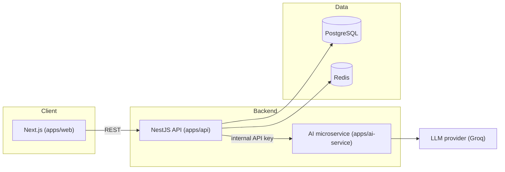

# AI Career Accelerator

A full-stack app that helps job seekers prep for jobs using AI. It covers resume feedback, interview practice, and technical interview prep, and it's all tailored to the actual company and role you're applying for instead of giving generic advice.

**Live:** [ai-career-accelerator-web.vercel.app](https://ai-career-accelerator-web.vercel.app)

[](https://github.com/mcai5-wq/ai-career-accelerator/actions/workflows/ci.yml)

## What it does

- **Resume analysis**: scores your resume against a job description (like an ATS would), then tells you which keywords you're missing and how to improve each section.
- **Interview prep**: mixes questions from a curated bank with ones generated by AI for the specific company and role you pick, and grades your written answers with a score, strengths, and what to improve.
- **Technical prep**: has AI break down which topics to study for a given company/role, then picks practice problems from a fixed catalog to match. The AI only chooses topics and weights, it never makes up problems or links on its own.
- **Auth**: email/password login with two-factor codes, Google sign-in, JWT tokens, and Redis so logged-out tokens actually get revoked instead of staying valid.
- **Fallbacks**: if the AI provider is down or fails, every AI feature just falls back to the static/bank content instead of breaking the request.

## How it's put together



The API and the AI service are two separate apps on purpose. The AI service doesn't hold any state and just wraps whatever LLM provider we're using, so the provider can change without touching the main app's logic. It's also locked down with a shared internal key so only the API can call it, never the frontend directly.

## Tech stack

| Layer | Stack |
|---|---|
| Frontend | TypeScript, Next.js (App Router), React, Tailwind CSS, Auth.js, TanStack Query |
| API | TypeScript, NestJS, Prisma, PostgreSQL, Redis, JWT/Passport |
| AI service | Python, FastAPI, Pydantic |
| Infra | Docker, Turborepo, GitHub Actions (CI), Vercel, Render, Neon, Upstash |
| Testing | Jest (API), Pytest (AI service) |

## Project layout

```
apps/
  web/          Next.js frontend
  api/          NestJS backend (auth, resumes, interviews, technical prep, donations)
  ai-service/   Python FastAPI service that talks to the LLM provider
infra/          docker-compose files for local Postgres/Redis and prod reference
render.yaml     Render Blueprint for deploying api + ai-service
```

## Running it locally

You'll need Node 24+, Python 3.13+, and Docker installed.

```bash
# install JS dependencies (this is an npm workspaces monorepo, run at the repo root)
npm install

# start local Postgres + Redis
npm run db:up

# apply database migrations
npm run db:migrate

# start the web and api apps
npm run dev
```

The AI service runs on its own:

```bash
cd apps/ai-service
pip install -r requirements.txt
uvicorn app.main:app --reload
```

Each app is configured through environment variables. Check `infra/.env.production.example` for the full list you'll need in production.

## Testing

```bash
# API unit tests
cd apps/api && npm test

# AI service tests
cd apps/ai-service && pytest
```

CI lints, type-checks, and tests all three apps on every push. See `.github/workflows/ci.yml`.

## Deployment

- **Frontend** runs on Vercel, deployed from `apps/web`.
- **API and AI service** run on Render, set up from `render.yaml` as a Blueprint, using the same Dockerfiles as local prod builds.
- **Database and cache** are Neon (managed Postgres) and Upstash (managed Redis).
